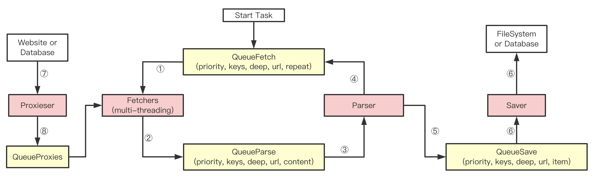

# PSpider

A simple web spider frame written by Python, which needs Python3.8+

### Features of PSpider

1. Support multi-threading crawling mode (using threading)
2. Support using proxies for crawling (using threading and queue)
3. Define some utility functions and classes, for example: UrlFilter, get_string_num, etc
4. Fewer lines of code, easyer to read, understand and expand

### Modules of PSpider

1. utilities module: define some utilities functions and classes for multi-threading spider
2. instances module: define classes of Fetcher, Parser, Saver for multi-threading spider
3. concurrent module: define WebSpiderFrame of multi-threading spider

### Procedure of PSpider

①: Fetchers get TaskFetch from QueueFetch, and make requests based on this task  
②: Put the result(TaskParse) of ① to QueueParse, and so Parser can get task from it  
③: Parser gets task from QueueParse, and parses content to get new TaskFetchs and TaskSave  
④: Put the new TaskFetchs to QueueFetch, and so Fetchers can get task from it again  
⑤: Put the TaskSave to QueueSave, and so Saver can get task from it  
⑥: Saver gets TaskSave from QueueSave, and saves items to filesystem or database  
⑦: Proxieser gets proxies from web or database, and puts proxies to QueueProxies  
⑧: Fetcher gets proxies from QueueProxies if needed, and makes requests based on this proxies

### Tutorials of PSpider

**Installation: you'd better use the first method**  
（1）Copy the "spider" directory to your project directory, and `import spider`  
（2）Install spider to your python system using `python3 setup.py install`

**See test.py**

### TodoList

1. More Demos
2. Distribute Spider
3. Execute JavaScript

### If you have any questions or advices, you can commit "Issues" or "Pull requests"
